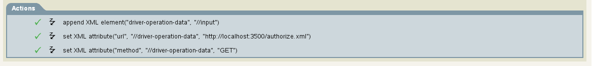

# Set driver-opertion-data (ie Soap Driver URL and Method)

1) Append XML
```
<do-append-xml-element expression="//input" name="driver-operation-data"/>
```
2) Add URL
```
<do-set-xml-attr expression="//driver-operation-data" name="url">
	<arg-string>
		<token-text xml:space="preserve">http://localhost:3500/authorize.xml</token-text>
	</arg-string>
</do-set-xml-attr>
```
3) Add method
```
<do-set-xml-attr expression="//driver-operation-data" name="method">
	<arg-string>
		<token-text xml:space="preserve">GET</token-text>
	</arg-string>
</do-set-xml-attr>
```

Entire policy:
```
<rule>
	<description>Override HTTP</description>
	<conditions>
		<and/>
	</conditions>
	<actions>
		<do-append-xml-element expression="//input" name="driver-operation-data"/>
		<do-set-xml-attr expression="//driver-operation-data" name="url">
			<arg-string>
				<token-text xml:space="preserve">http://localhost:3500/authorize.xml</token-text>
			</arg-string>
		</do-set-xml-attr>
		<do-set-xml-attr expression="//driver-operation-data" name="method">
			<arg-string>
				<token-text xml:space="preserve">GET</token-text>
			</arg-string>
		</do-set-xml-attr>
	</actions>
</rule>
```

Action should look like the following:

